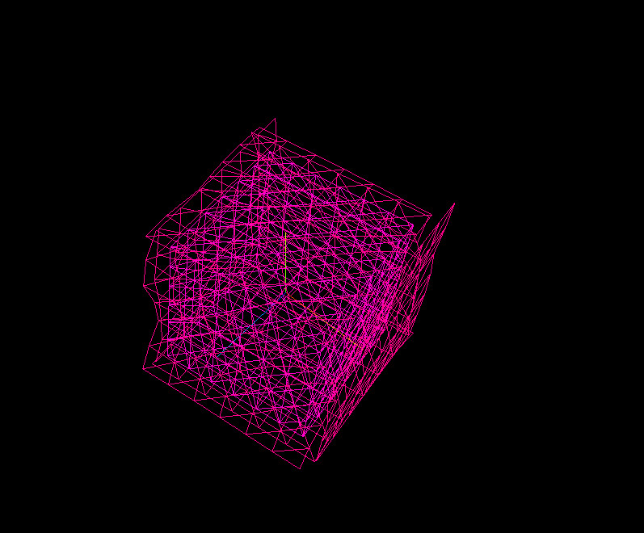

# Simple spectrogram in a form of a 3D cube done with tone.js and three.js

first run ``npm install`` (to install all the dependencies)

then go to src directory and use parcel to deploy the test page with:
``parcel --no-cache index.html``

### Usage
very simple mouse commands like zoom and rotate can be done. To start the sound you need to do ``left click``

### Possible future development
 the idea is to make the cube responsive, so depending from which side you are watching the cube it should be transforming the cube in different ways based on different algorithms.
 For now there is only fft analyizer. but there might be some more interesting sound analization algorithms possible with ``meyda.js`` (``https://meyda.js.org/``).
 
